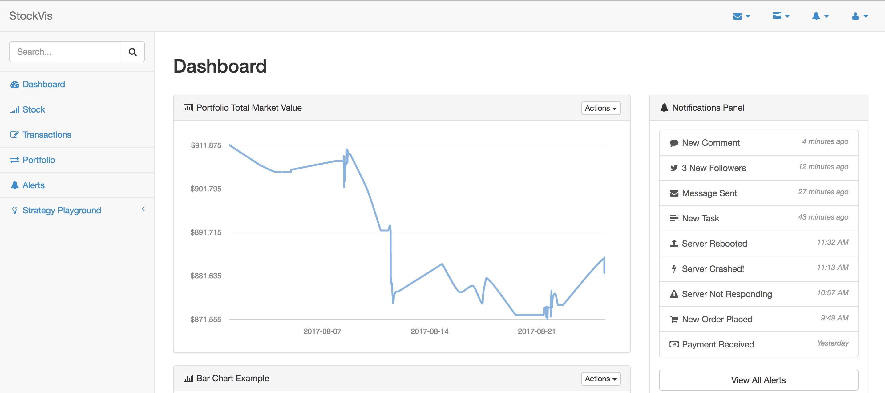

# botbot
A bot for stock and financial stuff vis (development in progress).

Currently it has no backend stoage yet, using HTML5 Browser session to do persistent storage for some experiementing ideas...

### 1. Portfolio Vis
#### Portfolio Breakdown and Grouping (updates/min)

#### Real-time Portfolio Value Monitoring (updates/min)

